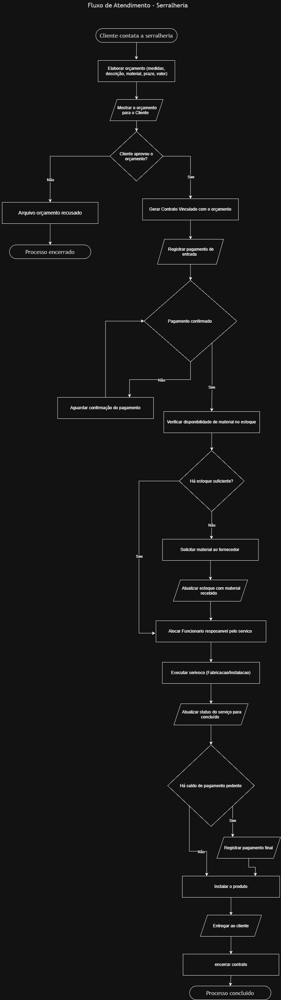

# 🏗️ Projeto Integrador — Modelagem de Dados
### Curso de Engenharia de Software — UNICID
**Professor:** Clovis Ferraro | **São Paulo — 2026**

---

## 👥 Equipe

| Nome | RA |
|------|----|
| Jonas Mateus de Sousa de Araújo | 47252766 |
| Marcos André Aragão da Cunha | 48229776 |
| Marlon Dias De Sousa | — |
| Murilo Souza dos Santos | 48108987 |
| Eduardo Chaves Santos | 48043087 |
| Guilherme Alves | 48129861 |
| Paulo Peralta Soto | — |
| Daniel Santana Cavalcante | 47391812 |

---

## 🏢 Empresa Analisada — Space Metal

A **Space Metal** é uma empresa atuante no setor de **construção civil**, especializada na **prestação de serviços de serralheria em geral**. Seus principais clientes são construtoras e o cliente final (pessoa física). Seus setores de atuação abrangem construção e indústria.

---

## 📋 Justificativa da Escolha

Escolhemos a Space Metal porque, mesmo sendo uma empresa que atua na construção civil e na serralheria, percebemos que a tecnologia pode melhorar bastante a produção deles.

- **Processos para Análise:** A empresa possui um fluxo completo, que vai do orçamento inicial, passa pela compra de produtos, chega à fabricação e termina na instalação na obra. Esse passo a passo fornece bastante material para modelar.
- **Problemas na Organização das Informações:** Hoje a empresa tem dificuldade real em centralizar os dados. A equipe não se comunica bem, ainda usa controles manuais e a gestão de compras acaba gerando desperdício de material.
- **Necessidade de Integração:** Eles precisam melhorar de forma urgente a comunicação entre a área que fecha os contratos e a oficina que executa o serviço. Essa integração é essencial para acabar com o retrabalho.
- **Aplicação do Sistema ERP:** Com os problemas claros de gestão de estoque e de orçamentos, o cenário está ideal para implementar um sistema ERP que centralize tudo e automatize os registros de contratos e pagamentos da Space Metal.

---

## 📄 Documentação Completa (Roteiro de Entrevista)

> ⚠️ **O arquivo abaixo é o documento vivo do projeto — está sendo atualizado continuamente conforme o modelo evolui.**

📎 [**Clique aqui para acessar o Roteiro de Entrevista Completo (Etapas 1 a 18)**](https://acadcruzeirodosul-my.sharepoint.com/:w:/g/personal/marcos_cunha008_cs_cruzeirodosul_edu_br/IQC91U12VWYISIcnbx4Cidz9AfFruIJS6NCDJmTunjc3k8M?e=KgMzdm)

---

## 🗺️ Fluxograma dos Processos

O fluxograma representa o fluxo real de trabalho da Space Metal, desde o contato do cliente até a entrega e instalação da obra.



---

## 🗄️ Diagrama Entidade-Relacionamento (DER)

O DER abaixo reflete o modelo de dados final validado pela equipe, contendo todas as entidades, relacionamentos, cardinalidades e tabelas associativas.

.png>)

---

## 🧩 Entidades do Modelo

| Entidade | Descrição |
|----------|-----------|
| **CLIENTE** | Construtoras e clientes finais que solicitam orçamentos |
| **ORÇAMENTO** | Orçamentos gerados, incluindo os recusados (RN03) |
| **CONTRATO** | Gerado a partir de orçamentos aprovados por ambas as partes |
| **SERVIÇO** | Serviços personalizados executados pela empresa |
| **PRODUTO** | Materiais utilizados na execução dos serviços |
| **ESTOQUE** | Controle de quantidade atual e mínima dos materiais |
| **FORNECEDOR** | Parceiros para cotação e compra de matéria-prima |
| **PAGAMENTO** | Registro de sinais, parcelas e formas de pagamento |
| **FUNCIONÁRIO** | Colaboradores vinculados aos serviços executados |

---

## 🔗 Tabelas Associativas (Relacionamentos N:N)

| Tabela | Resolve a relação | Atributos próprios |
|--------|-----------------|--------------------|
| **contém** | ORÇAMENTO ↔ SERVIÇO | id_contem (PK), medidas, sub_total, quantidade |
| **Precisa** | SERVIÇO ↔ PRODUTO | id_precisa (PK), quantidade_necessaria |
| **Executa** | FUNCIONÁRIO ↔ SERVIÇO | id_executar (PK) |

---

## 📏 Principais Regras de Negócio

| Código | Regra |
|--------|-------|
| RN01 | Todo contrato exige pelo menos 30% de sinal antes de iniciar os trabalhos |
| RN03 | Orçamentos recusados ficam registrados no sistema |
| RN04 | Um orçamento só vira contrato quando aprovado por ambas as partes |
| RN05 | Pagamentos podem ser parcelados em 30 a 60 dias |
| RN06 | Um funcionário pode atuar em mais de um serviço simultaneamente |
| RN07 | Compras de matéria-prima passam por cotação entre fornecedores |
| RN10 | Descontos limitados a 3% (ou até 10% em casos especiais), com autorização do CEO |
| RN11 | Cancelamentos retêm 5% do valor já pago pelo cliente |

---

## 📁 Estrutura do Repositório

```
Trabalho-Modelagem-de-dados/
│
├── README.md
│
├── Diagramas/
│   ├── Serralheria-DER.drawio (2).png
│   └── Serralheria-Fluxograma.drawio.png
│
├── Documentacao/
│   ├── Roteiro de Entrevista Completo - Etapas 1 a 18 (Serralheria) (1) (4).pdf
│   └── Manual da Primeira Entrega - Modelagem de Dados (1).pdf
│
├── Aulas_Material_Apoio/
│
└── Rascunhos/
```

---

## ✅ Status da Entrega

- [x] Caracterização da empresa
- [x] Justificativa da escolha
- [x] Processos de negócio mapeados
- [x] Problemas e necessidades identificados
- [x] Requisitos funcionais (RF01–RF18)
- [x] Requisitos não funcionais (RNF01–RNF07)
- [x] Regras de negócio (RN01–RN13)
- [x] Restrições e políticas organizacionais
- [x] Fluxograma dos processos
- [x] Entidades identificadas e justificadas
- [x] Atributos definidos (com PK e FK)
- [x] Relacionamentos mapeados
- [x] Cardinalidades determinadas
- [x] Relacionamentos N:N verificados e resolvidos
- [x] Atributos das tabelas associativas definidos
- [x] DER elaborado no Draw.io
- [x] Dicionário de Dados Conceitual Preliminar
- [x] Justificativas Técnicas das Decisões
